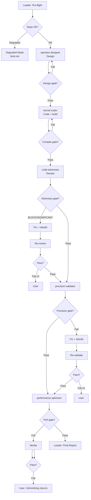

# Workflow: CUDA Operator / Kernel Pipeline

## 生态优先（Stage 1 之前牢记）

1. 对照 [reference-ecosystem.md](reference-ecosystem.md)：GEMM/卷积/规约等是否可由 **cuBLAS / CUTLASS / cuDNN / CUB** 承担。  
2. **目标模型族**（默认 **Qwen / DeepSeek**）：对照 [reference-target-models.md](reference-target-models.md) 中的算子条目、MoE、量化与精度默认；非默认模型族由用户在 Pre-flight 确认。  
3. 推理/LLM 类需求：主动检索 **vLLM**、**TensorRT-LLM**（及 FlashAttention 等）中 **同类算子的目录与绑定方式**，在设计中写明「参考路径」，减少重复造轮。  
4. 仅当库无法覆盖（特殊融合、layout、数值路径）时，再进入完整手写 kernel 的 tiling 设计。

## Overview



## Steps (summary)

| Step | Executor | Gate |
|------|-----------|------|
| 0 | Leader | User go/no-go on missing deps |
| 1 | operator-designer | 含 **Ecosystem Strategy**、**Target Model / Workload Alignment** 等必选小节 → DESIGN-COMPLETE |
| 2 | kernel-coder | nvcc/link SUCCESS |
| 3 | code-adversary | LOW-RISK / ACCEPTABLE-RISK |
| 4 | precision-validator | PRECISION-PASS |
| 5 | performance-optimizer | TARGET-MET or ≥20% vs baseline |
| 6 | Leader | Final Report |

## Final Report Format

```markdown
# CUDA Operator Dev & Optimize Report

## Summary
[算子名、目标模型族、dtype、精度结论、性能结论]

## Stage 1: Design
- Verdict: DESIGN-COMPLETE / ...
- Target model / workload: [Qwen / DeepSeek / both / other + 型号或配置摘要]
- Shape & precision path: [hidden, heads, seq/MoE 参数, bf16/fp8/量化等]
- Ecosystem: [cuBLAS / CUTLASS / cuDNN / CUB / raw kernel / mixed + 理由]
- Reference repos: [e.g. vLLM / TensorRT-LLM paths reviewed]
- Tiling: [grid/block/tile, or N/A if library-only]
- Memory: [shared/reg or workspace sizing]

## Stage 2: Code
- Verdict: CODE-COMPILABLE / ...
- Linked libs: [e.g. CUTLASS, cuBLASLt, …]
- Files: [.cu, host, CMake / extension]
- Build: SUCCESS / FAILED

## Stage 3: Adversarial Review
- Verdict: LOW-RISK / ACCEPTABLE-RISK / SIGNIFICANT-RISK / BLOCK
- Defects: [CRITICAL/HIGH/...]
- Kick-backs: [N]

## Stage 4: Precision
- Verdict: PRECISION-PASS / ...
- Cases: [N], worst error: [...]

## Stage 5: Performance
- Verdict: PERFORMANCE-TARGET-MET / IMPROVED / NO-GAIN
- Baseline vs opt: [kernel time or achieved BW]
- Metrics: [occupancy, mem throughput, NCU section if any]
- Serving alignment: [纯 kernel 指标 / 可选：每 token、端到端 step、KV 带宽等 — 若无法测量则注明 N/A 与原因]

## Gate History
[各 gate pass/fail + retries]

## Recommendations
[后续：是否可进一步交给 CUTLASS Epilogue/cuBLASLt、多流重叠、或对齐 vLLM/TRT-LLM 某条实现]
```

## Acceptance Criteria

- 五角色输出均符合各自 `## Output Schema`。
- Final Report 含所有必选节；对抗与精度门禁未静默跳过。
- BLOCK / PRECISION-FAIL 须用户显式接受方可标为完成。
